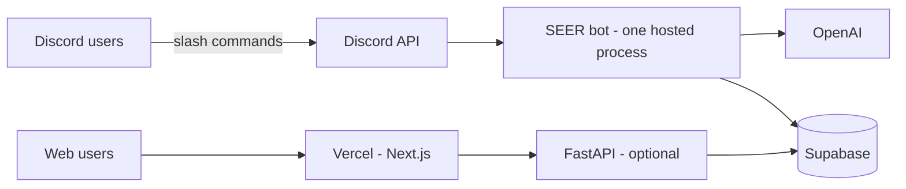

# Project S.E.E.R.

AI-powered Discord agent for Rutgers club and event discovery.

## How it works for your users

**Discord users never run the bot or enter API keys.** They join your Discord server and use slash commands (`/ask`, `/discover`, `/search`, `/events`, `/help`). One bot process runs 24/7 in the cloud; everyone talks to that same instance.

| Who | Runs software? | Needs secrets? |
|-----|----------------|----------------|
| Students / Discord users | No | No |
| You (deploy once) | Yes — hosted worker | Yes — set once in Render/etc. |
| Developers (local testing) | Optional — their machine | Yes — personal `bot/.env` only |

Secrets (`DISCORD_BOT_TOKEN`, `OPENAI_API_KEY`, Supabase keys, etc.) are **server-side only**. They live in your hosting provider’s environment variables, not in the repo and not on end-user devices.



## Production deployment (Render)

### 1. Discord bot (required)

The bot must run as an **always-on Background Worker** (not serverless).

1. Go to [render.com](https://render.com) → **New** → **Blueprint** → connect this GitHub repo.
2. Render reads root **`render.yaml`**, which defines:
   - **`seer-discord-bot`** (worker) — `python discord_bot/bot.py` in `bot/`
   - **`seer-api`** (optional web service) — FastAPI on `$PORT` with `/health`
3. When prompted, enter env vars from `.env.example` (group **`seer-env`**). You only set them once; both services share the group.
4. Deploy. Keep **`seer-discord-bot`** on at least a **Starter** plan so the worker does not sleep.

**Manual setup (without Blueprint):** New → Background Worker → root directory **`bot`**, build `pip install -r requirements.txt`, start `python discord_bot/bot.py`, add the same env vars.

**Invite the bot** (once): Discord Developer Portal → OAuth2 → scopes `bot` + `applications.commands` → invite to your server. `DISCORD_GUILD_ID` must be that server’s ID.

Docker alternative: `bot/Dockerfile.bot` runs the same bot process if you prefer `runtime: docker` in `render.yaml`.

### 2. Web dashboard (optional)

Deploy **`web/`** on [Vercel](https://vercel.com):

- Set `NEXT_PUBLIC_API_URL` to your Render API URL (e.g. `https://seer-api.onrender.com` from the blueprint).
- No OpenAI or Discord tokens are needed in the web app.

### 3. API (optional — only if you use the web UI or scraper routes)

Deploy **`bot/`** API with `uvicorn app.main:app --host 0.0.0.0 --port 8000` (see `bot/Dockerfile`). Same env vars as the bot. Can be the same host as the bot or a second service.

## Secrets: set once, share with the team safely

1. **Never commit** `bot/.env` (already in `.gitignore`).
2. **Production**: enter variables only in Render (env group `seer-env`) / Vercel project settings.
3. **Developers**: copy `.env.example` → `bot/.env` for local runs, or share a team vault (1Password, Bitwarden) — not Slack or email.
4. **CI**: GitHub Actions already uses dummy values in `.github/workflows/ci.yml`; do not put real keys in workflow files unless using encrypted secrets for deploy steps.

One Discord application = one `DISCORD_BOT_TOKEN` for the whole project. All users share that bot; you do not issue per-user Discord tokens.

## Local development

```bash
# Bot (only needed if you are developing or testing locally)
cd bot && python -m venv .venv && source .venv/bin/activate  # or: conda activate ./.venv
pip install -r requirements.txt
cp ../.env.example .env   # fill in bot/.env — local only
python discord_bot/bot.py

# API (optional locally)
uvicorn app.main:app --reload

# Web (optional locally)
cd web && npm install && npm run dev
```

Use **Python 3.12** locally (3.13 breaks pinned `pydantic`).

See `.env.example` for required variables: `DISCORD_BOT_TOKEN`, `DISCORD_GUILD_ID`, `OPENAI_API_KEY`, `ADMIN_API_KEY`, `SUPABASE_URL`, `SUPABASE_KEY`.
