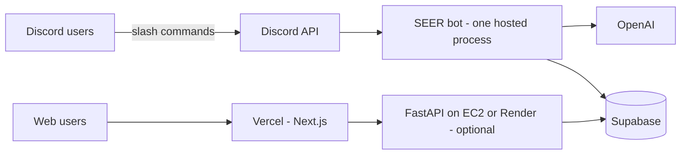

# Project S.E.E.R.

AI-powered Discord agent for Rutgers club and event discovery.

## How it works for your users

**Discord users never run the bot or enter API keys.** They join your Discord server and use slash commands (`/ask`, `/discover`, `/search`, `/events`, `/help`). One bot process runs 24/7 in the cloud; everyone talks to that same instance.

| Who | Runs software? | Needs secrets? |
|-----|----------------|----------------|
| Students / Discord users | No | No |
| You (deploy once) | Yes — hosted worker | Yes — set once on Render/EC2/etc. |
| Developers (local testing) | Optional — their machine | Yes — personal `bot/.env` only |

Secrets (`DISCORD_BOT_TOKEN`, `OPENAI_API_KEY`, Supabase keys, etc.) are **server-side only**. They live in your hosting provider’s environment variables, not in the repo and not on end-user devices.



## Production deployment (Render)

### 1. Discord bot (required)

The bot must run as an **always-on Background Worker** (not serverless).

1. Go to [render.com](https://render.com) → **New** → **Blueprint** → connect this GitHub repo.
2. Render reads root **`render.yaml`**, which defines:
   - **`seer-discord-bot`** (worker) — `python discord_bot/bot.py` in `bot/`
   - **`seer-api`** (optional web service) — FastAPI on `$PORT` with `/health`
3. When prompted, enter env vars from `.env.example` (group **`seer-env`**). You only set them once; both services share the group.
4. Deploy. Keep **`seer-discord-bot`** on at least a **Starter** plan so the worker does not sleep.

**Manual setup (without Blueprint):** New → Background Worker → root directory **`bot`**, build `pip install -r requirements.txt`, start `python discord_bot/bot.py`, add the same env vars.

**Invite the bot** (once): Discord Developer Portal → OAuth2 → scopes `bot` + `applications.commands` → invite to your server. `DISCORD_GUILD_ID` must be that server’s ID.

**Discord commands:** `/ask`, `/discover`, `/search`, `/events`, `/instagram`, `/tickets`, `/explore_events`, `/ask_tickets`, `/date_ideas`, `/ask_date`, `/help`. Restart the bot after deploy to register slash commands.

**Tri-state tickets:** `/tickets`, `/explore_events`, and `/ask_tickets` (conversational) include buy links (SeatGeek, Gametime, StubHub, etc.) for NY / NJ / PA.

**Date Ideas:** `/date_ideas` and `/ask_date` suggest plans near Rutgers with Google Maps, Yelp, OpenTable, and Eventbrite links.

**Real-time data:** The Discord bot syncs getINVOLVED to Supabase every `DATA_SYNC_INTERVAL_MINUTES` (default 30) and refreshes a live event cache every `LIVE_EVENTS_CACHE_MINUTES` (default 10). Event commands pull from the live API first.

**Optional event announcements:** Set `DISCORD_UPDATES_CHANNEL_ID` in `bot/.env` to a channel ID; the bot will post embeds when new events appear (next 14 days).

**Manual sync:** `python -m app.scrapers.getinvolved` from `bot/` or `POST /scrape/trigger/getinvolved` with admin key.

Docker alternative: `bot/Dockerfile.bot` runs the same bot process if you prefer `runtime: docker` in `render.yaml`.

### Production deployment (AWS EC2)

Use EC2 when you want a single VPS you control (same as Render’s always-on worker, but on your AWS account).

**What runs on the instance**

| Process | Required? | Inbound ports |
|---------|-----------|---------------|
| Discord bot (`python discord_bot/bot.py`) | **Yes** | None (outbound only) |
| FastAPI (`uvicorn app.main:app`) | Optional (web UI / scraper) | **8000** (or 443 behind nginx) |

Supabase stays hosted on Supabase; the EC2 box only runs Python.

**1. Launch EC2**

1. AWS Console → **EC2** → **Launch instance**.
2. **Ubuntu 24.04 LTS**, **t3.small** (2 GB RAM; use t3.micro only for light testing).
3. **Key pair** — download `.pem` for SSH.
4. **Security group**
   - **Discord bot only:** no inbound rules required.
   - **With API:** allow **TCP 8000** from your IP (or put nginx + 443 in front later).
5. **Storage:** 20 GB gp3 is enough.
6. Launch, then **Elastic IP** (optional but recommended if you expose the API and don’t use a load balancer).

**2. SSH and clone**

```bash
ssh -i your-key.pem ubuntu@<EC2_PUBLIC_IP>
sudo mkdir -p /opt/seer && sudo chown ubuntu:ubuntu /opt/seer
cd /opt/seer
git clone https://github.com/YOUR_ORG/events_chatbot.git .
```

**3. Secrets**

```bash
cp .env.example bot/.env
nano bot/.env   # DISCORD_BOT_TOKEN, DISCORD_GUILD_ID, OPENAI_API_KEY,
                # SUPABASE_URL, SUPABASE_KEY, ADMIN_API_KEY, TICKETMASTER_API_KEY, …
```

Run Supabase migrations (`bot/migrations/*.sql`) in the Supabase SQL editor if you haven’t already.

**4. Bootstrap (systemd — recommended)**

```bash
sudo bash deploy/ec2/bootstrap.sh
sudo systemctl start seer-discord-bot
sudo journalctl -u seer-discord-bot -f    # logs; look for "Discord bot ready"
```

Optional API:

```bash
sudo systemctl enable --now seer-api
curl http://127.0.0.1:8000/health
```

Set Vercel `NEXT_PUBLIC_API_URL=http://<EC2_IP>:8000` (or `https://api.yourdomain.com` if you add TLS).

**5. Docker alternative**

```bash
# install Docker on Ubuntu, then from repo root:
docker compose -f deploy/ec2/docker-compose.yml up -d --build
# API: docker compose -f deploy/ec2/docker-compose.yml --profile api up -d --build
```

**6. Updates**

```bash
cd /opt/seer && git pull
cd bot && .venv/bin/pip install -r requirements.txt
sudo systemctl restart seer-discord-bot
# sudo systemctl restart seer-api
```

**7. Checklist**

- Discord Developer Portal → Bot → **Message Content Intent** ON (coach thread replies).
- OAuth2 invite: scopes `bot` + `applications.commands`.
- Only **one** bot process company-wide (don’t run Render + EC2 with the same token).
- Logs: `journalctl -u seer-discord-bot -n 100 --no-pager`

Unit files live in `deploy/ec2/` (`seer-discord-bot.service`, `seer-api.service`).

### 2. Web dashboard (optional)

Deploy **`web/`** on [Vercel](https://vercel.com):

- Set `NEXT_PUBLIC_API_URL` to your Render API URL (e.g. `https://seer-api.onrender.com` from the blueprint).
- No OpenAI or Discord tokens are needed in the web app.

### 3. API (optional — only if you use the web UI or scraper routes)

Deploy **`bot/`** API with `uvicorn app.main:app --host 0.0.0.0 --port 8000` (see `bot/Dockerfile`). Same env vars as the bot. Can be the same host as the bot or a second service.

## Secrets: set once, share with the team safely

1. **Never commit** `bot/.env` (already in `.gitignore`).
2. **Production**: enter variables only in Render (env group `seer-env`) / Vercel project settings.
3. **Developers**: copy `.env.example` → `bot/.env` for local runs, or share a team vault (1Password, Bitwarden) — not Slack or email.
4. **CI**: GitHub Actions already uses dummy values in `.github/workflows/ci.yml`; do not put real keys in workflow files unless using encrypted secrets for deploy steps.

One Discord application = one `DISCORD_BOT_TOKEN` for the whole project. All users share that bot; you do not issue per-user Discord tokens.

## Local development

```bash
# Bot (only needed if you are developing or testing locally)
cd bot && python -m venv .venv && source .venv/bin/activate  # or: conda activate ./.venv
pip install -r requirements.txt
cp ../.env.example .env   # fill in bot/.env — local only
python discord_bot/bot.py

# API (optional locally)
uvicorn app.main:app --reload

# Web (optional locally)
cd web && npm install && npm run dev
```

Use **Python 3.12** locally (3.13 breaks pinned `pydantic`).

See `.env.example` for required variables: `DISCORD_BOT_TOKEN`, `DISCORD_GUILD_ID`, `OPENAI_API_KEY`, `ADMIN_API_KEY`, `SUPABASE_URL`, `SUPABASE_KEY`.
